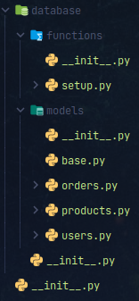

# SQLAlchemy. Integration to aiogram

Now you will learn how to integrate SQLAlchemy with your bots on aiogram. We will be
using [This Template](https://github.com/Latand/tgbot_template).

## Database connection

In order to connect to the database, we will provide a connection string the same as we did in the previous tutorial.

However, in out bots we use environment variables to get params like `POSTGRES_USER`, `POSTGRES_PASSWORD`, `POSTGRES_DB`
and `POSTGRES_HOST`. They are stored in `.env` file.

> .env
>
> ```
> POSTGRES_USER=testuser
> POSTGRES_PASSWORD=testpassword
> POSTGRES_DB=testuser
> DB_HOST=localhost
> DB_PORT=5433
> ```

Now, we'll retrieve these variables in `tgbot/config.py` file.

```python

from sqlalchemy.engine import URL

...


@dataclass
class DbConfig:
    host: str
    password: str
    user: str
    database: str
    port: int

    # We provide a method to create a connection string easily.
    def construct_sqlalchemy_url(self, library='asyncpg') -> URL:
        return str(URL.create(
            drivername=f"postgresql+{library}",
            username=self.user,
            password=self.password,
            host=self.host,
            port=self.port,
            database=self.database,
        ))


@dataclass
class Config:
    tg_bot: TgBot
    ...

    # We put db config in our main config class
    db: DbConfig


# and later we retrieve variables from .env file
def load_config(path: str = None):
    env = Env()
    env.read_env(path)

    return Config(
        tg_bot=TgBot(
            token=env.str("BOT_TOKEN"),
            admin_ids=list(map(int, env.list("ADMINS"))),
            use_redis=env.bool("USE_REDIS"),
        ),
        db=DbConfig(
            host=env.str('DB_HOST'),
            password=env.str('POSTGRES_PASSWORD'),
            user=env.str('POSTGRES_USER'),
            database=env.str('POSTGRES_DB'),
            port=env.int('DB_PORT'),
        ),
    )
```

After that we can retrieve the connection string from the config class.

```python
from tgbot.config import load_config

config = load_config()
url = config.db.construct_sqlalchemy_url()
```

That url we can pass to `create_async_engine` function.

## Database template

To use SQLAlchemy in our template I will create a package `database` and put it in a directory
called `tgbot/infrasctructure`. There we will create other packages for our models (tables) and functions (for making
queries).

It will look like this:


Here, in the `functions` package we will create a module `setup` to initialize the database connection (with
sessionmaker).

> `database/functions/setup.py`
> ```python
> from typing import Callable, AsyncContextManager
>
> from sqlalchemy.ext.asyncio import create_async_engine, AsyncSession
> from sqlalchemy.orm import sessionmaker
> 
> from tgbot.config import DbConfig
> 
> 
> def create_session_pool(db: DbConfig, echo=False) -> Callable[[], AsyncContextManager[AsyncSession]]:
>     async_engine = create_async_engine(
>         db.construct_sqlalchemy_url(),
>         query_cache_size=1200,
>         pool_size=20,
>         max_overflow=200,
>         future=True,
>         echo=echo,
>     )
> 
> 
>     session_pool = sessionmaker(bind=async_engine, class_=AsyncSession)
>     return session_pool
> ```

You can see that we have added extra parameters to the `create_async_engine` function:

- `future`: we will use it to create a future engine.
- `echo`: we will use it to print the queries.
- `query_cache_size`: size of the cache used to cache the SQL string form of queries.
- `pool_size`: the number of connections to keep open inside the connection pool.
- `max_overflow`: the number of connections to allow in connection pool "overflow", that is connections that can be
  opened above and beyond the `pool_size` setting, which defaults to five.

## Models

Now, we will put our models in the `database/models` package. We create for each group of tables (that you can think of
as a group) a module.

We also create a module `base` to create a base (global variable) class for our models.

> `database/models/base.py`
> ```python
> from sqlalchemy.orm import declarative_base
>
> Base = declarative_base()
> ```

Now, we will separate and put our models into different files.

- `database/models/users.py`
- `database/models/orders.py`
- `database/models/products.py`



Great, now we can create some queries.

## Queries

It is very easy, we just put our functions from the previous tutorial into the `database/functions` package. We can also
separate our queries into different files.

You can see how it is done in the example code.

## Setting up with the bot

We will run the aforementioned `create_session_pool` in the `bot.py` file.

Just under the `dp = Dispatcher(bot, ...)` line we add:
`session_pool = create_session_pool(config.db)`

So now we need somehow to pass the session pool to the bot.

## Database Middleware

It is a good idea to use a single session for a single update. Every time the user interacts with the bot, we will
retrieve a session from the session pool. So that's why we need to create a middleware.

So we will create a middleware

> **Note**: We will inherit it from LifetimeControllerMiddleware, so it will process different types of 
> updates like `callback_query`, `message`, `inline_query` ... in one function `pre_process` 
> instead of `on_pre_process_callback_query`, `on_pre_process_message`, etc...

```python
from aiogram.dispatcher.middlewares import LifetimeControllerMiddleware


class DatabaseMiddleware(LifetimeControllerMiddleware):
    skip_patterns = ["error", "update"]
```

We provide skip_patterns, so it will not run for `on_pre_process_error`, or `on_pre_process_update`. We don't need to
have a session there. _Well, if you need it there, you can remove that_.

Then we will accept a `session_pool` as an argument and save it into a middleware attribute:

```python
def __init__(self, session_pool):
  super().__init__()
  self.session_pool = session_pool
```

Then we, when update (e.g. `Message`, `CallbackQuery`) is received, will get a session from session pool (although,
without context manager):

```python
async def pre_process(self, obj, data, *args):
  session = self.session_pool()
```

Then, we will update the data dictionary (that is going to be unpacked in handler):

```python
data['session'] = session
```

Now, you can access your obtained session in the handler like that:

```python
async def my_handler(message: Message, session):
    await session.execute(...)
```

After that, the update from the user is going to be passed into `post_process` function, where we will close our
session, so it will be returned to the session pool. You must do this, so you will not run out of sessions.

```python
    async def post_process(self, obj, data, *args):
    session = data['session']
    await session.close()
```

Perfect, now our middleware looks like that:

```python
from aiogram.dispatcher.middlewares import LifetimeControllerMiddleware


class DatabaseMiddleware(LifetimeControllerMiddleware):
    skip_patterns = ["error", "update"]

    def __init__(self, session_pool):
        super().__init__()
        self.session_pool = session_pool

    async def pre_process(self, obj, data, *args):
        session = self.session_pool()

        data['session'] = session

    async def post_process(self, obj, data, *args):
        session = data['session']
        await session.close()
```

And we need to import it and register in the `bot.py`

```python

from tgbot.middlewares.database import DatabaseMiddleware

...


def register_all_middlewares(dp, config, session_pool):
    ...
    # Registering our middleware and pass session pool as an argument
    dp.setup_middleware(DatabaseMiddleware(session_pool=session_pool))


async def main():
    ...

    session_pool = create_session_pool(config.db)

    register_all_middlewares(dp, config, session_pool)
```

## Using queries in handlers

Let's add one thing as the last example: registering new users.

Previously, we have created a function `create_user`, that is creating a new user, lets use it in our bot, in the
handler that reacts to `/start` command.

We will slightly change this function:

- We don't need to pass created_at, as the default value will be `NOW()`
- We need to make in async: `async def create_user`, and `await session.execute(...)`

```python
async def create_user(session, telegram_id, full_name, username, language_code, referrer_id=None):
    stmt = insert(User).values(
        telegram_id=telegram_id,
        full_name=full_name,
        username=username,
        language_code=language_code,
        referrer_id=referrer_id,
    )
    await session.execute(stmt)
```

However, we also need to skip an error, if the user has already been created, so let's first retrieve a user, and only
than (if missing) - create one. We can do that by using `session.get()` method.

We have a handler in the `tgbot/handlers/user.py` module:

```python
from aiogram import Dispatcher
from aiogram.types import Message


async def user_start(message: Message):
    await message.reply("Hello, user")


def register_user(dp: Dispatcher):
    dp.register_message_handler(user_start, commands=["start"], state="*")

```

Now let's add some queries:

```python
from tgbot.infrastucture.database.functions.users import create_user
from tgbot.infrastucture.database.models.users import User


async def user_start(message: Message, session: AsyncSession):
    user = await session.get(User, message.from_user.id)

    if not user:
        await create_user(
            session,
            telegram_id=message.from_user.id,
            full_name=message.from_user.full_name,
            username=message.from_user.username,
            language_code=message.from_user.language_code,
        )
        await session.commit()

    user = await session.get(User, message.from_user.id)
    user_info = (f"{user.full_name} (@{user.username}).\n"
                 f"Language: {user.language_code}.\n"
                 f"Created at: {user.created_at}.")

    await message.reply("Hello, user. \n"
                        "Your info is here: \n\n"
                        f"{user_info}")
```

## Run your code:

> **Note**: Don't forget to install dependencies, and to create and fill `.env` file.

```bash
cd tgbot_template
pip install -r requirements.txt
python bot.py
```

### Result:

